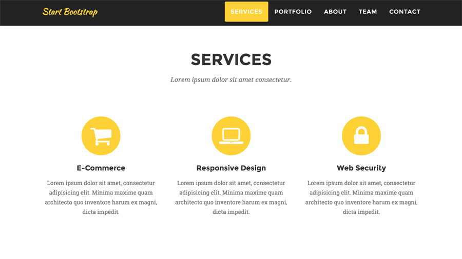
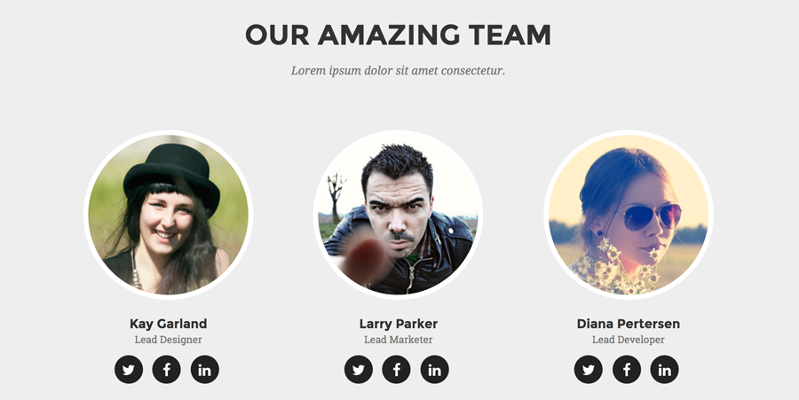

# How to create a express project step by step

## PART A: INSTALL THE BACKEND

### STEP 1º: Create a folder with a semanthic name

==>  `mkdir expressKata-II`

### STEP 2º: Initizalize the npm and use the ***'-y'*** especification to be faster and create the ***jason package*** file

==>  `npm init --y`

### STEP 3º: Install npm

Install into the directory (i.e. expressKata-II)

==>  `npm install express --save`

*the ***'-- save'*** especification indicates that the folder to save is the working directory (on the other hand, the ***'-g'*** especification install the package into the globla scope). But the best thing is that you create the ***json package*** file where there is the info to find the dependencies*

*'npm' stands for: node package manager.*

the json creates the project description (very important)

## PART B: INSTALL THE FRONTEND

### STEP 4º: Inititialite bower
Initizalize the bower package and use the '-y' especification to be faster and create the ***jason package*** file

==>  `bower init --y`

### STEP 5º: Install Bower

==>  `sudo npm install bower -g`

*In this case we install bower in the global mode ***'-g'***, for that reason if you work with apple computers you should introduce the ***'sudo'*** command in order to access to the user administration.*

### STEP 6º: Create a .gitignore file

The ***.gitignore'*** file should into the main directory in order to use ***'github'*** copy and maintain clean the repository from the dependencies as ***'node_modules'*** or ***'bower_components'***

==>  `touch gitignore`

### STEP 7º. Save the dependencies

Introduce into the ***.gitignore'*** file the dependencies to avoid be copied into ***'github'***:

```
node_modules
bower_components
```

### STEP 8º: Create a .bowerrc

The ***'.bowerrc'*** file into the main directory in order to choose the path where copying the bower components.

***'github'*** copy and maintain clean the repository from the dependencies as ***'node_modules'*** or ***'bower_components'***

==>  `touch .bowerrc`

### STEP 9º: Complete the .bowerrc file

Introduce into this file the directory you want to use, for example:

```
{
  "directory": "public/bower_components"
}
```

The best idea is to include the dependencies into a folder into public/bower_components.

The systax is the same than an obnject because is an object.

### STEP 10º: Install *'the bootstrap librery'*

This librery goes into the working directory using bower install:

==>  `bower install bootstrap --save`

*With ***'--save'*** you write this dependency into the jason package file where there is the info to find the rest os dependencies*


### STEP 11º: Install pug *'the pug package'*

This package goes into the working directory using npm istall:

==>  `npm install pug --save`

*With ***'--save'*** you write this dependency into the jason package file where there is the info to find the rest os dependencies*

The pug files allow us to create a dinamic behavior that html connot offer.

### STEP 12º: Create the first file app.js.

`touch app.js

You can use this notation as an example:

```
const express = require("express") // calling express
const app = express()  // defining the function
const PORT = 3000  // choosing a PORT (always uppercase)


// by default the engine of render is 'pug'

app.set("view engine", "pug") // defining dependencies
app.use(express.static("public"))

// indicating routes to server
// we want to locate in this place the statics documents
// for that reason the html files must be into this folder


//root directory

app.get('/', (req, res) => {
    res.render('index')
})

// frender could have two arguments, the second is an odject

// const title = 'My Super Project'
//    res.render('index', { title })

// we can do with express almost the same that with AngularJS


app.listen(PORT, () => console.log('listening port 3000'))
```


//direc

### STEP 13º: Create a 'views' directory

Into this directory create a intex.pug file

`mkdir views`

`cd views`

`touch index.pug`

14º Write somo content into this file as:

h2 This is the first content


### STEP 15ª: Add a shorcout to call th server

Into the package.json file find this piece code:

```
  "scripts": {
    "test": "echo \"Error: no test specified\" && exit 1"
  },
```

and change it whit this other code:

```
 "scripts": {
    "start": "node app.js"
  },
```

whit this change you can call the server quicky via terminal with this command:

`npm start node`

now (after call 'npm start' into termial') you can go to the browser and write inton the url:

we can define another stcrits for example:

"dev" nodemon

but we must write before the word 

`npm run dev`

it shoud be a index.pug file into the views folder. This command avoid to init the server every change.

`http://localhost:3000`

And 'voilà'. you have the page index.pug as you create it.


# How create an express project as fast that you cannot believe

Lets replicate [this bootstrap templete](https://blackrockdigital.github.io/startbootstrap-agency/) with the squeleton we just created.
**Credits of the template:**
Copyright 2013-2016 Blackrock Digital LLC.
`git clone https://github.com/BlackrockDigital/startbootstrap-agency.git`


## jade
[Knowing about JADE](https://pugjs.org/api/getting-started.html)


## Installing dependencies

in order to installl all the dependencies that are into a Json, we use the command:

`npm install`


## Project images







how to use variables:


creating in app a variable

const  title = 

and into the render we create an object.

title =


notes;

in order to receive data installa
body parser

installa body parser:

npm install body-parser:

add the 

 // create application/json parser 
var jsonParser = bodyParser.json()
 
// create application/x-www-form-urlencoded parser 
var urlencodedParser = bodyParser.urlencoded({ extended: false })
 


